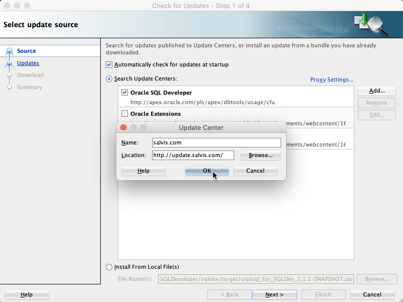
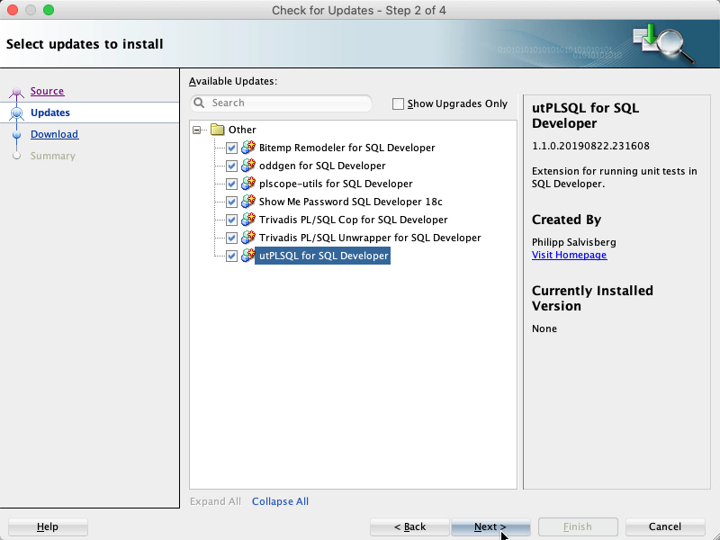
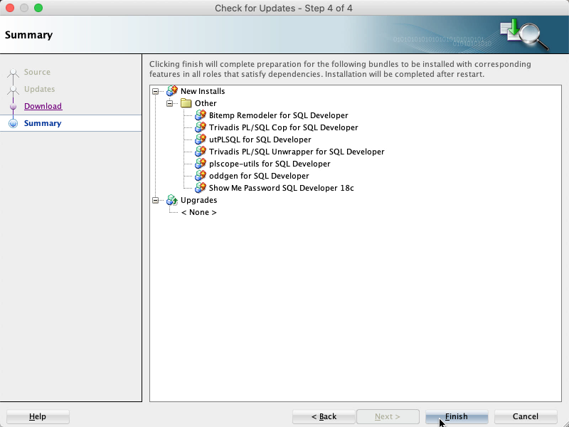
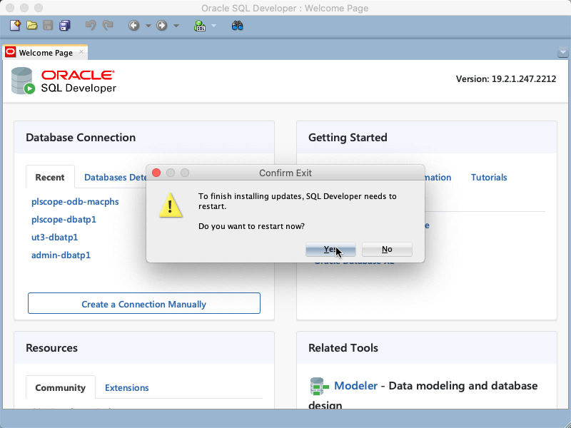

# Update Center for free SQL Developer Extensions

## Introduction

In July 2017 Oracle announced to release updates for SQL Developer on a quarterly basis. Installing multiple versions of SQL Developer on the same machine is not a problem. Therefore many developers install a new version as soon as it becomes available. On the first start SQL Developer offers to import the settings of the previous version. This works quite well for most settings. However, all third-party extensions must be installed manually afterwards. This is a cumbersome and boring task. 

This repository maintains an update center for a set of freely available SQL Developer extensions to speed up the configuration of a new SQL Developer installation.

## Considered SQL Developer Extensions

The following SQL Developer extensions are included in the update center:

- [utPLSQL](https://github.com/utPLSQL/utPLSQL-SQLDeveloper)
- [oddgen](https://github.com/oddgen/oddgen) 
- [Bitemp Remodeler](https://github.com/oddgen/bitemp)
- [db\* CODECOP](https://github.com/Trivadis/plsql-cop-sqldev)
- [PL/SQL Unwrapper](https://github.com/Trivadis/plsql-unwrapper-sqldev)
- [plscope-utils](https://github.com/PhilippSalvisberg/plscope-utils/blob/main/sqldev/README.md)
- [Show Me Password](https://github.com/tomecode/show-me-password-sqldev-jdev)

## Usage

Click the `Help` menu and select `Check for Updates…`. Press the `Add` button to register the update center http://update.salvis.com/ . For this URL a redirect to https://philippsalvisberg.github.io/sqldev-update/sqldeveloper.xml is configured. The content is synchronized by GitHub based on the [docs/sqldeveloper.xml](docs/sqldeveloper.xml) in the master branch of this repository. 

Then press `Next >` to show the available updates. Select the updates you want and press `Next >` to start the download process.

Wait until all updates are downloaded and press `Finish`.

Restart SQL Developer to install the downloaded updates.

## Issues

Please file your bug reports, enhancement requests, questions and other support requests within [Github's issue tracker](https://help.github.com/articles/about-issues/).

* [Questions](https://github.com/PhilippSalvisberg/sqldev-update/issues?q=is%3Aissue+label%3Aquestion)
* [Open enhancements](https://github.com/PhilippSalvisberg/sqldev-update/issues?q=is%3Aopen+is%3Aissue+label%3Aenhancement)
* [Open bugs](https://github.com/PhilippSalvisberg/sqldev-update/issues?q=is%3Aopen+is%3Aissue+label%3Abug)
* [Submit new issue](https://github.com/PhilippSalvisberg/sqldev-update/issues/new)

## License

sqldev-update is licensed under the Apache License, Version 2.0. You may obtain a copy of the License at <http://www.apache.org/licenses/LICENSE-2.0>.
